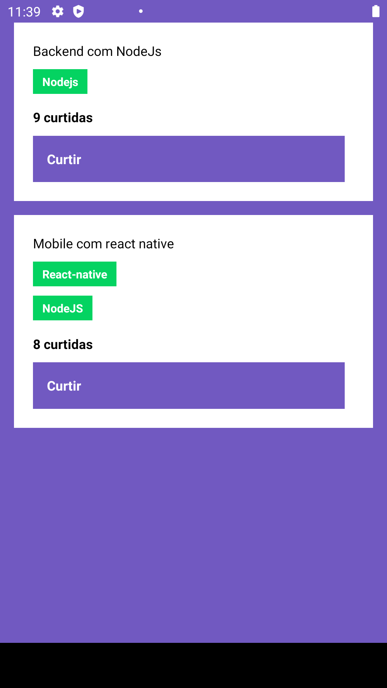

# React-native-concepts

## Sobre este Projeto

Desafio desenvolvido para a segunda semana do bootcamp GoStack da Rocketseat. Neste projeto foram utilizadas as tecnologias React Native e NodeJS e foram aplicados conceitos importantes como por exemplo: Componentização, estado, rotas, rest API e muito mais!

## Como Instalar

Caso você já tenha o android studio, SDK e node configurado corretamente, basta clonar o repositório, digitar o comando yarn para instalar os pacotes e executar o comando npx react-native run-android (É precisa estar com o emulador aberto para dar certo).

Print do app antes de curtir

Print do app depois de curtir

